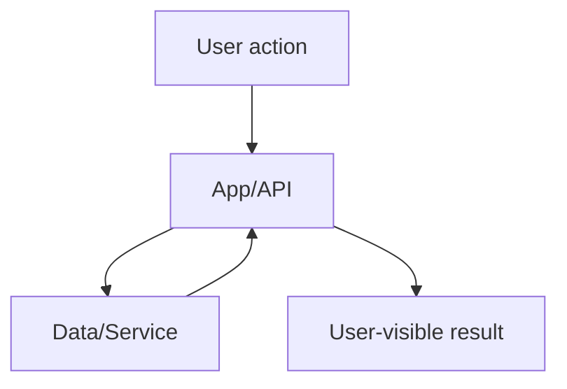

## Summary

<!-- What changed and why? Include business/product context briefly. -->

## Problem Statement

<!-- What user or system problem does this PR solve? -->

## Scope

<!-- In scope for this PR -->

## Non-Goals

<!-- Explicitly out of scope to avoid ambiguity -->

## User Stories

<!-- Format:
- As a <type of user>, I want <goal>, so that <benefit>.
-->

## Acceptance Criteria

<!-- Convert product expectations into testable checks -->
- [ ] Criterion 1
- [ ] Criterion 2

## Implementation Notes

<!-- Key technical decisions, tradeoffs, and constraints -->

## Architecture / Flow Diagram (Mermaid, if helpful)



## Test Plan

<!-- Required for behavior changes. If no tests were added, explain why. -->

### Automated Tests

- [ ] Unit
- [ ] Integration
- [ ] E2E
- [ ] N/A (explain below)

Commands run:

```bash
# example
# npm test
```

Results:

<!-- Paste concise output summary -->

### Manual Verification

- [ ] Scenario 1
- [ ] Scenario 2
- [ ] N/A (explain why)

## Risks and Mitigations

<!-- What could break? How is risk reduced? -->

## Rollout / Rollback

<!-- Deploy considerations and rollback steps, if applicable -->

## Follow-ups

<!-- Deferred work, cleanup, or future enhancements -->

