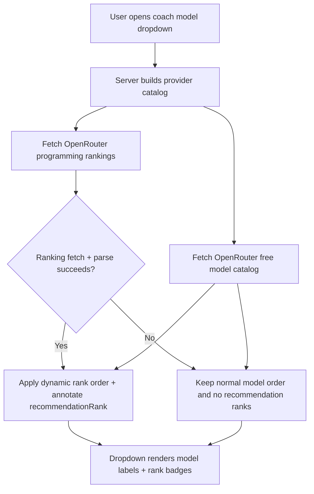

# OpenRouter Programming Ranking UX Design

## Overview
This design documents how the Coach model dropdown surfaces OpenRouter free models in programming-quality order and clearly communicates recommendations to the user.

## Goals
- Prioritize the strongest free programming models at the top of the model dropdown.
- Keep model selection fully usable even if ranking endpoints change or become unavailable.
- Provide lightweight recommendation cues (`#rank` + icon) without adding noise.

## Non-Goals
- Replacing OpenRouter's ranking logic.
- Blocking model loading when rankings are unavailable.
- Introducing a separate admin-managed model curation pipeline.

## User Experience
- OpenRouter models are listed in recommendation order when dynamic ranking data is available.
- Each ranked model shows a recommendation badge:
  - `#1`: trophy icon
  - `#2-#3`: medal icon
  - `#4+`: sparkles icon
- If dynamic ranking data is unavailable:
  - Model list still loads and remains selectable.
  - Dropdown uses standard model order with no recommendation rank badges.

## Design Principles
- Explicit over clever: ranking is visible in UI, not hidden behavior.
- Graceful degradation: no blocking network dependency for core chat controls.
- Minimal cognitive load: simple icon + rank badge, no complex scoring UI.

## Interaction Flow

## Accessibility Notes
- Rank indicators are text-backed (`#N`) in addition to iconography.
- Existing select interaction patterns and keyboard behavior are preserved.

## Future Extensions
- Optional tooltip on rank badge to explain source: "Based on OpenRouter programming rankings".
- Optional timestamp for "ranking last updated" when telemetry is added.
