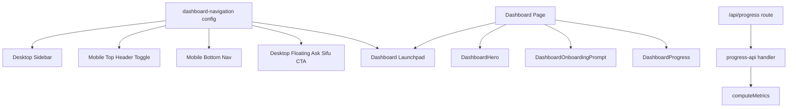

## Summary

Simplified the dashboard into a focused launchpad, centralized navigation metadata, added mobile-first navigation patterns, and hardened progress/onboarding reliability. Follow-up UX iterations introduced a consistent `Ask Sifu` entry point across mobile and desktop with coach-route safeguards.

## Proposal / Design Links

- Plan review decisions from this thread (Architecture/Code Quality/Tests/Performance all `A`)
- Plan template reference: `docs/project/plan-review-template.md`

## Problem Statement

Dashboard had duplicated metrics/navigation, high visual clutter, weak mobile-first routing into Coach Chat, and limited testing around dashboard responsiveness and progress contract behavior.

## Scope

- Shared dashboard/navigation config consumed by sidebar, mobile primary nav, and dashboard launchpad
- Dashboard page decomposition into explicit sections
- Mobile bottom nav with `Home`, `Coach`, `Plan`, `More`
- Mobile top-right coach toggle with route-aware copy (`Ask Sifu` / `To Dojo`)
- Desktop floating coach CTA (`Ask Sifu`) on non-coach routes only
- Progress pipeline improvements (batched reads, streak helper optimization, testable handler extraction)
- Reliability hardening from PR review feedback (RPC fallback behavior, toast dedupe, deferred logout flow)
- New unit and e2e coverage for dashboard/nav/perf-critical helpers

## Non-Goals

- No full redesign of app-wide visual system
- No DB migration included in this PR
- No feature changes to non-dashboard workflows beyond navigation wiring

## User Stories

- As a candidate doing interview prep, I want a cleaner dashboard launchpad so I can jump directly into the highest-value next action.
- As a mobile user, I want persistent primary navigation so Coach Chat and Plan are always one tap away.
- As an engineer, I want one navigation source of truth so labels/routes/icons do not drift across surfaces.

## Acceptance Criteria

- [x] Dashboard launchpad uses prioritized actions from shared nav config with Coach Chat first.
- [x] Mobile has persistent bottom nav (`Home`, `Coach`, `Plan`, `More`) and secondary routes in the More sheet.
- [x] `Ask Sifu` entry point is consistent in mobile and desktop UI language and iconography.
- [x] Desktop floating coach CTA does not render on `/coach`, preventing composer/input overlap.
- [x] Dashboard metrics and onboarding save failures present explicit user-visible retry/error feedback.
- [x] Progress API route remains backwards-compatible in response shape.
- [x] Added automated tests for nav selectors, streak logic, progress handler contract, and dashboard responsive behavior.

## Implementation Notes

- Added `web/src/lib/dashboard-navigation.ts` with explicit metadata (`id`, `href`, `label`, `hint`, `icon`, `domain`, `priority`, visibility flags).
- `Sidebar.tsx` now consumes shared selectors and introduces `MobileBottomNav`.
- `Sidebar.tsx` now includes:
  - `MobileCoachToggle` with route-aware label/icon state.
  - `DesktopCoachFloatingCta` (`Ask Sifu`) hidden on `/coach` to keep chat composition unobstructed.
- Dashboard page now orchestrates four sections:
  - `DashboardHero`
  - `DashboardOnboardingPrompt`
  - `DashboardLaunchpad`
  - `DashboardProgress`
- Added SWR tuning (`revalidateOnFocus: false`, `dedupingInterval`) and explicit retry UI for load failures.
- Added toast feedback for onboarding prompt save success/failure with deduping for repeated dashboard fetch errors.
- Refactored metrics loading to batch memory file reads via `readMemoryFiles`.
- Extracted progress request orchestration into `web/src/lib/progress-api.ts` for testability.
- Extracted streak logic into `web/src/lib/streak.ts` and normalized to UTC-safe day math.
- Hardened progress day loading:
  - Caches missing `list_progress_event_days` RPC availability to avoid repeated failing calls.
  - Accepts both object (`{ day }[]`) and primitive (`string[]`) RPC payload shapes.

## Alternatives Considered

- Keep dashboard quick-actions broad and duplicate sidebar:
  rejected due to ongoing clutter and DRY violations.
- Keep mobile sheet-only navigation:
  rejected because it hides high-frequency actions behind an extra tap.
- Add server cache layer first:
  deferred because simpler SWR tuning + batched reads already reduce pressure with lower complexity.

## Edge Cases and Failure Modes

- Missing/failed metrics fetch now surfaces visible retry UI.
- Dashboard fetch errors no longer spam duplicate toasts across SWR revalidations.
- Onboarding enrichment save now surfaces explicit failure toast and success confirmation.
- Mobile More sheet deferred logout now reliably opens dialogs after sheet close.
- Coach composer/input no longer risks being blocked by desktop floating CTA on `/coach`.
- Streak math now avoids timezone off-by-one caused by local/UTC mixing.

## DRY / Tech Debt Impact

- Removed duplicated nav definitions by centralizing configuration.
- Reduced dashboard page monolith by extracting section components.
- Added testable business helpers to reduce framework-coupled logic.

## Architecture / Flow Diagram (Mermaid, if helpful)



## Test Plan

### Automated Tests

- [x] Unit
- [x] Integration
- [x] E2E
- [ ] N/A (explain below)

Commands run:

```bash
cd web && npm test
cd web && npx eslint src/lib/streak.ts src/lib/metrics.ts 'src/app/(dashboard)/page.tsx' src/components/layout/Sidebar.tsx src/lib/metrics.test.mts
cd web && npx playwright test tests/chat-responsive.spec.ts tests/dashboard-responsive.spec.ts
```

Results:

- Unit/integration tests passed (`97/97`).
- Targeted lint passed for modified files.
- Dashboard/chat responsive e2e specs executed and were skipped in this environment when authenticated route preconditions were unavailable.

### Manual Verification

- [x] Dashboard opens with hero CTA and reduced launchpad cards.
- [x] Mobile bottom nav shows Home/Coach/Plan/More.
- [x] More sheet includes secondary routes and logout action.
- [x] Mobile top-right `Ask Sifu`/`To Dojo` toggle is route-aware and fast to access.
- [x] Desktop floating `Ask Sifu` CTA appears on non-coach routes and stays hidden on `/coach`.

## Risks and Mitigations

- Risk: mobile navigation regression due fixed header + bottom nav layering.
  Mitigation: retained existing mobile header and added bottom padding in dashboard layout.
- Risk: route behavior regression from handler extraction.
  Mitigation: covered 401/500/200 contract through progress handler tests.
- Risk: CTA layering could obstruct coach composition UX.
  Mitigation: render desktop floating CTA only outside `/coach`.

## Rollout / Rollback

- Rollout: ship as normal frontend change with no migration dependency.
- Rollback: revert branch commits scoped to dashboard/mobile-nav refactor and CTA polish (`git revert <commit>...`), no data migration rollback required.

## Follow-ups

- Add DB-level day-distinct progress RPC (`list_progress_event_days`) for optimized streak reads in all environments.
- Add authenticated e2e fixture for non-skipped dashboard responsive assertions in CI.
