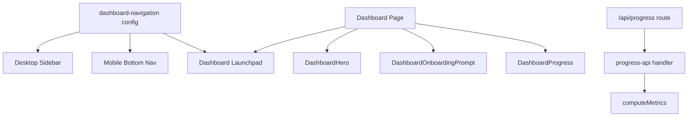

## Summary

Refactored dashboard home into a focused launchpad, removed duplicated navigation definitions, added persistent mobile primary navigation, and hardened progress/onboarding reliability and performance paths.

## Proposal / Design Links

- Plan review decisions from this thread (Architecture/Code Quality/Tests/Performance all `A`)
- Plan template reference: `docs/project/plan-review-template.md`

## Problem Statement

Dashboard had duplicated metrics/navigation, high visual clutter, weak mobile-first routing into Coach Chat, and limited testing around dashboard responsiveness and progress contract behavior.

## Scope

- Shared dashboard/navigation config consumed by sidebar, mobile primary nav, and dashboard launchpad
- Dashboard page decomposition into explicit sections
- Mobile bottom nav with `Home`, `Coach`, `Plan`, `More`
- Progress pipeline improvements (batched reads, streak helper optimization, testable handler extraction)
- New unit and e2e coverage for dashboard/nav/perf-critical helpers

## Non-Goals

- No full redesign of app-wide visual system
- No DB migration included in this PR
- No feature changes to non-dashboard workflows beyond navigation wiring

## User Stories

- As a candidate doing interview prep, I want a cleaner dashboard launchpad so I can jump directly into the highest-value next action.
- As a mobile user, I want persistent primary navigation so Coach Chat and Plan are always one tap away.
- As an engineer, I want one navigation source of truth so labels/routes/icons do not drift across surfaces.

## Acceptance Criteria

- [x] Dashboard launchpad uses prioritized actions from shared nav config with Coach Chat first.
- [x] Mobile has persistent bottom nav (`Home`, `Coach`, `Plan`, `More`) and secondary routes in the More sheet.
- [x] Dashboard metrics and onboarding save failures present explicit user-visible retry/error feedback.
- [x] Progress API route remains backwards-compatible in response shape.
- [x] Added automated tests for nav selectors, streak logic, progress handler contract, and dashboard responsive behavior.

## Implementation Notes

- Added `web/src/lib/dashboard-navigation.ts` with explicit metadata (`id`, `href`, `label`, `hint`, `icon`, `domain`, `priority`, visibility flags).
- `Sidebar.tsx` now consumes shared selectors and introduces `MobileBottomNav`.
- Dashboard page now orchestrates four sections:
  - `DashboardHero`
  - `DashboardOnboardingPrompt`
  - `DashboardLaunchpad`
  - `DashboardProgress`
- Added SWR tuning (`revalidateOnFocus: false`, `dedupingInterval`) and explicit retry UI for load failures.
- Added toast feedback for onboarding prompt save success/failure.
- Refactored metrics loading to batch memory file reads via `readMemoryFiles`.
- Extracted progress request orchestration into `web/src/lib/progress-api.ts` for testability.
- Extracted streak logic into `web/src/lib/streak.ts` and switched membership checks to `Set`.

## Alternatives Considered

- Keep dashboard quick-actions broad and duplicate sidebar:
  rejected due to ongoing clutter and DRY violations.
- Keep mobile sheet-only navigation:
  rejected because it hides high-frequency actions behind an extra tap.
- Add server cache layer first:
  deferred because simpler SWR tuning + batched reads already reduce pressure with lower complexity.

## Edge Cases and Failure Modes

- Missing/failed metrics fetch now surfaces visible retry UI.
- Onboarding enrichment save now surfaces explicit failure toast and success confirmation.
- Mobile More sheet preserves deferred logout behavior to avoid dialog/sheet overlap.

## DRY / Tech Debt Impact

- Removed duplicated nav definitions by centralizing configuration.
- Reduced dashboard page monolith by extracting section components.
- Added testable business helpers to reduce framework-coupled logic.

## Architecture / Flow Diagram (Mermaid, if helpful)



## Test Plan

### Automated Tests

- [x] Unit
- [x] Integration
- [x] E2E
- [ ] N/A (explain below)

Commands run:

```bash
cd web && node --test --experimental-strip-types --experimental-specifier-resolution=node src/lib/dashboard-navigation.test.mts src/lib/metrics.test.mts src/lib/progress-api.test.mts
cd web && npm run test:e2e -- --grep "dashboard remains usable|dashboard shows retry" --reporter=line
```

Results:

- Unit/integration helper tests passed.
- Dashboard e2e spec executed and was skipped in this environment when authenticated route preconditions were unavailable (same skip pattern used in existing responsive specs).

### Manual Verification

- [x] Dashboard opens with hero CTA and reduced launchpad cards.
- [x] Mobile bottom nav shows Home/Coach/Plan/More.
- [x] More sheet includes secondary routes and logout action.

## Risks and Mitigations

- Risk: mobile navigation regression due fixed header + bottom nav layering.
  Mitigation: retained existing mobile header and added bottom padding in dashboard layout.
- Risk: route behavior regression from handler extraction.
  Mitigation: covered 401/500/200 contract through progress handler tests.

## Rollout / Rollback

- Rollout: ship as normal frontend change with no migration dependency.
- Rollback: revert these three commits on `feat/dashboard-simplification-mobile-nav`.

## Follow-ups

- Add DB-level day-distinct progress RPC (`list_progress_event_days`) for optimized streak reads in all environments.
- Add authenticated e2e fixture for non-skipped dashboard responsive assertions in CI.
