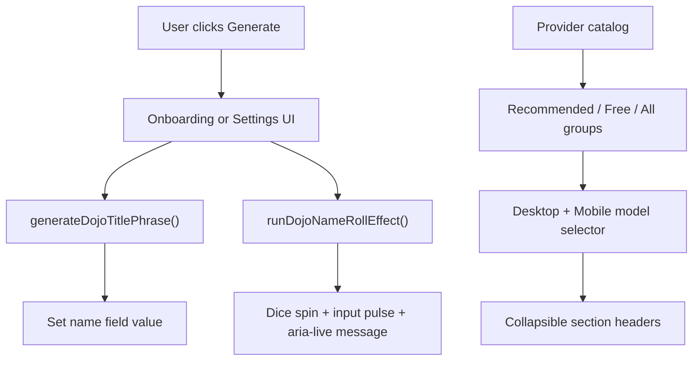

## Summary

Adds two shipped scopes in one PR:
- Dojo profile name generation in onboarding/settings with accessible micro-interactions.
- OpenRouter programming ranking integration for model ordering and ranking badges in chat controls, plus grouped selector UX refinements (`Recommended`, `Free`, `All`) with collapsible sections.

## Proposal / Design Links

- Exempt: small UX behavior enhancement implemented directly without a separate proposal artifact.

## Problem Statement

Users lacked fast, on-theme name inspiration during onboarding/profile setup, leading to friction and generic placeholder names.

## Scope

- Add curated two-part dojo name generator utility.
- Add onboarding random prefill fallback when no existing name is available.
- Add explicit "Generate Dojo Name" controls in onboarding and settings.
- Add accessibility attributes and subtle UI feedback animations.
- Add unit tests for generator behavior and timing constants.
- Add dynamic OpenRouter programming ranking fetch/caching and annotate/sort model options by rank.
- Show recommendation rank badges in model selectors and tighten control layout behavior.
- Add explicit `Free Models` group in OpenRouter selector.
- Make OpenRouter model groups collapsible/expandable in both mobile and desktop controls.

## Non-Goals

- Persisting generator history.
- User-customizable word banks.
- Server-side name generation.
- Replacing static OpenRouter fallback catalog behavior when remote endpoints fail.

## User Stories

- As a student entering the dojo, I want one-click random name generation, so that I can start quickly with a fun themed identity.
- As a returning user, I want to reroll my profile name in settings, so that I can update my dojo identity without manual brainstorming.

## Acceptance Criteria

- [x] Onboarding can generate a random dojo name on demand.
- [x] Onboarding prefills a random dojo name only when no draft/account name exists.
- [x] Settings can generate a random dojo name on demand.
- [x] Generate buttons include dice icon, accessible labeling, and tooltip text.
- [x] Name generation feedback includes light animation and screen-reader live updates.
- [x] Generator utility has 20+ options for each word list and deterministic tests.
- [x] OpenRouter model selector has grouped sections for Recommended, Free, and All models.
- [x] OpenRouter Recommended/All sections are collapsible/expandable on mobile and desktop.

## Implementation Notes

- Added `generateDojoTitlePhrase()` for lightweight phrase generation when full object shape is not needed.
- Kept existing `generateDojoTitle()` for compatibility and testability.
- Centralized animation window in `DOJO_TITLE_ROLL_EFFECT_MS` and reused across onboarding/settings.
- Reduced onboarding bootstrap state churn by merging draft + prefill + fallback into a single `setCore` update.
- Extended provider catalog grouping with a dedicated `Free Models` OpenRouter group.
- Added non-selectable group header toggle buttons with preserved keyboard/search behavior in model dropdowns.

## Alternatives Considered

- Option A: Generate names server-side from API route.
  - Rejected: unnecessary network cost and latency for deterministic local UI behavior.
- Option B: Keep only object-based generator return type.
  - Rejected: minor but avoidable allocations in hot UI click path.
- Option C: No animation feedback.
  - Rejected: lower perceived responsiveness and weaker affordance for reroll action.

## Edge Cases and Failure Modes

- Existing draft name is preserved; random prefill does not override it.
- Existing account display/prefill name is preserved; random prefill only used when both are absent.
- Repeated rapid clicks reset animation timer cleanly without stacking leaks.
- Timer cleanup on unmount prevents stale state updates.
- OpenRouter search keeps matching grouped results visible while preserving section toggle state.

## DRY / Tech Debt Impact

- DRY improvement: shared `DOJO_TITLE_ROLL_EFFECT_MS` avoids duplicated magic numbers.
- DRY improvement: shared `generateDojoTitlePhrase()` avoids repeated string assembly logic.
- DRY improvement: reused grouped rendering pattern across desktop and mobile model selectors.
- No known new debt introduced.

## Architecture / Flow Diagram (Mermaid, if helpful)



## Test Plan

### Automated Tests

- [x] Unit
- [ ] Integration
- [ ] E2E
- [ ] N/A (explain below)

Commands run:

```bash
npm run lint -- src/components/chat/ChatControls.tsx src/lib/provider-catalog.ts
npm test
```

Results:

- Pass: lint on touched selector/catalog files.
- Pass: 128 tests, 0 failures.
- Verified grouped OpenRouter selector behavior is wired through provider catalog and dropdown rendering paths.

### Manual Verification

- [x] Scenario 1
- [x] Scenario 2
- [ ] N/A (explain why)

- Scenario 1: Onboarding name step shows generate button; clicking rerolls name and shows animation/feedback.
- Scenario 2: Settings profile name section rerolls name and shows animation/feedback without save regressions.
- Scenario 3: Coach model selector shows Recommended/Free/All groups and allows section collapse/expand on desktop and mobile.

## Risks and Mitigations

- Risk: animation state timers could leak on unmount.
  - Mitigation: explicit timer cleanup effect in both onboarding and settings.
- Risk: reroll accidentally overriding existing persisted names.
  - Mitigation: fallback prefill logic only applies when name is empty.

## Rollout / Rollback

- Rollout: standard web deploy; no schema/env changes.
- Rollback: revert this PR commit safely (UI-only + local utility changes).

## Follow-ups

- Consider optional user-defined custom adjective/noun pools.
- Consider telemetry event for "name generated" interaction frequency.
