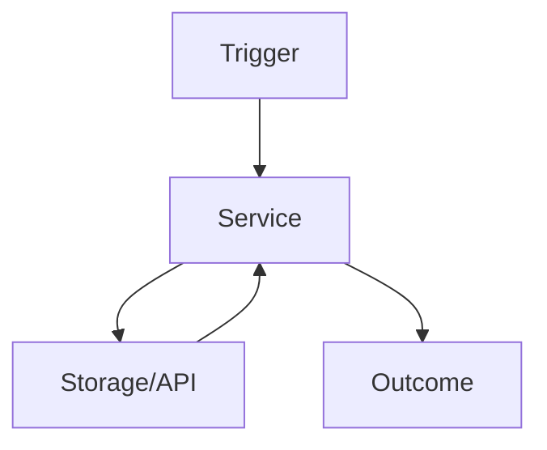

# Feature Proposal Template

Use this template before implementing a new feature or major behavior change.

## 1) Problem Statement

- What problem exists today?
- Who is affected?
- Why now?

## 2) Scope

- In scope:
- Out of scope (non-goals):

## 3) User Stories

- As a `<type of user>`, I want `<goal>`, so that `<benefit>`.

## 4) Acceptance Criteria

- [ ] Criterion 1
- [ ] Criterion 2

## 5) Architecture and Data Flow

- Component boundaries:
- Data flow:
- API boundaries:
- Auth/data access/security implications:

## 6) Technical Approach

- Proposed implementation plan:
- Why this approach:
- Dependencies or migrations:

## 7) Alternatives Considered

### Option A (Recommended)

- Impact:
- Effort:
- Risks:
- Maintenance cost:

### Option B

- Impact:
- Effort:
- Risks:
- Maintenance cost:

### Option C (Do Nothing, if reasonable)

- Impact:
- Effort:
- Risks:
- Maintenance cost:

## 8) Risks and Tradeoffs

- Known risks:
- Tradeoffs accepted:
- Rollback strategy:

## 9) Edge Cases and Failure Modes

- Edge case 1:
- Edge case 2:
- Failure path behavior:

## 10) Test Strategy

- Unit tests:
- Integration tests:
- E2E/manual verification:
- Deferred tests (if any) with rationale and follow-up issue:
