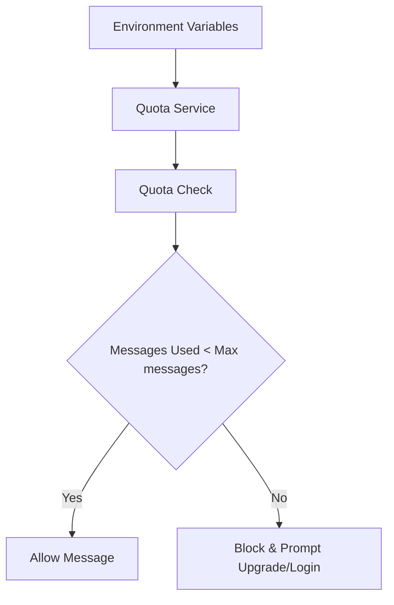

# Feature Proposal: Increase Guest Limit

## 1) Problem Statement

- What problem exists today? The current guest limit is 25 messages, which might be too low for new users to fully experience the value of Sifu Quest before being prompted to log in.
- Who is affected? Potential new users who want to try the app as guests.
- Why now? Increasing the limit allows for a more generous trial experience, potentially improving conversion from guest to registered users.

## 2) Scope

- In scope:
  - Transitioning from hardcoded `FREE_TIER_MAX_USER_MESSAGES` to `NEXT_PUBLIC_FREE_TIER_MAX_MESSAGES` environment variable.
  - Setting the default value to 25.
  - Updating relevant tests.
- Out of scope (non-goals):
  - Modifying the login/onboarding flow itself.

## 3) User Stories

- As a guest user, I want to use the app for a bit longer before I'm forced to log in, so that I can see if it's truly useful for me.
- As an admin, I want to be able to adjust the guest limit via environment variables without changing the code.

## 4) Acceptance Criteria

- [ ] `NEXT_PUBLIC_FREE_TIER_MAX_MESSAGES` is added to `.env.example`.
- [ ] `web/src/lib/quota.ts` reads from `process.env.NEXT_PUBLIC_FREE_TIER_MAX_MESSAGES` with a default of 25.
- [ ] All tests pass with the new limit and env var logic.
- [ ] No regression in quota enforcement logic.

## 5) Architecture and Data Flow

The guest limit is now dynamic, read from environment variables.

## 6) Technical Approach

- Proposed implementation plan:
  - Add `NEXT_PUBLIC_FREE_TIER_MAX_MESSAGES=25` to `.env.example`.
  - Update `web/src/lib/quota.ts` to parse the env var.
  - Update hardcoded values in `web/src/lib/free-quota.test.mts`.
- Why this approach: It fulfills the user's request for configurability via environment variables.
- Dependencies or migrations: New environment variable needs to be set in production/staging.

## 7) Alternatives Considered

### Option A (Recommended) - Use Environment Variable

- Impact: Highly configurable, fulfills user request.
- Effort: Low.
- Risks: If env var is misconfigured (e.g., non-numeric), fallback must be robust.
- Maintenance cost: None.

### Option B - Hardcoded Constant

- Impact: Less flexible.
- Effort: Minimal.
- Risks: Requires code change to adjust limit.
- Maintenance cost: None.

## 8) Risks and Tradeoffs

- Known risks: Increased usage of the shared free-tier OpenRouter key.
- Tradeoffs accepted: Willing to trade slightly higher costs for better user trial experience.
- Rollback strategy: Revert the constant change.

## 9) Edge Cases and Failure Modes

- Edge case 1: Users who already used 10+ messages but were blocked will suddenly have more messages available.
- Failure path behavior: If the constant is not correctly picked up, the old limit might still be enforced.

## 10) Test Strategy

- Unit tests: Run `web/src/lib/free-quota.test.mts` and ensure it reflects the new limit.
- Manual verification: Check the UI to see if the progress bar/quota indicator shows the correct total (25).
