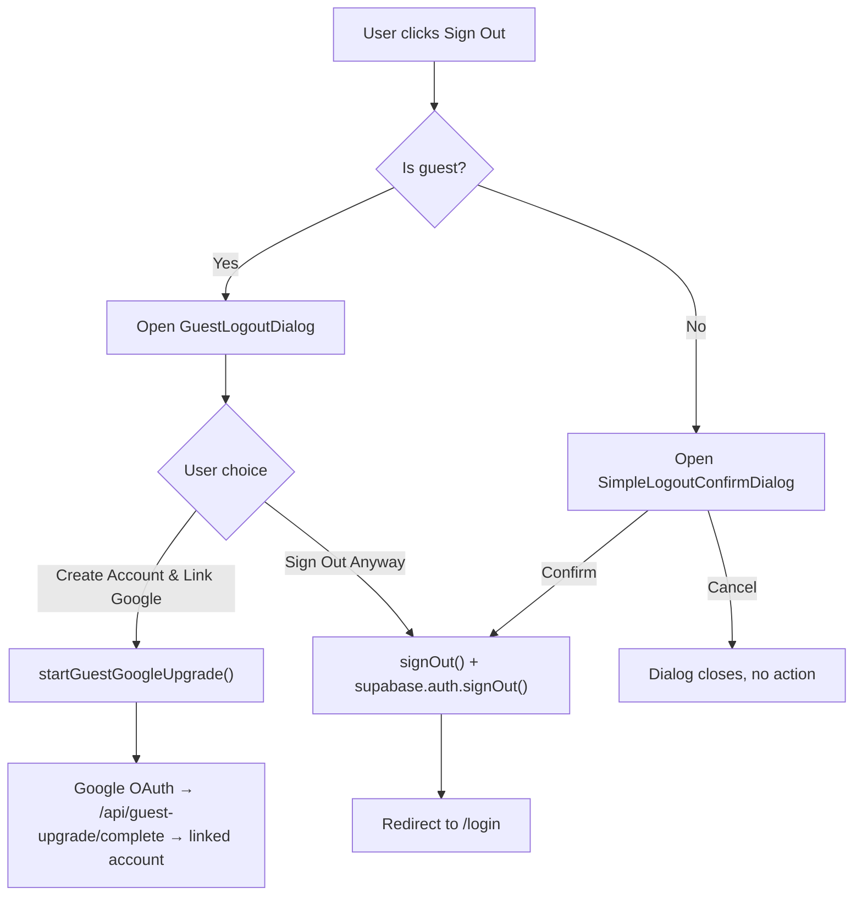

# Feature Proposal: Logout & Guest-to-Account Conversion

> [!IMPORTANT]
> **Design constraints (non-negotiable):**
> - **Colour palette**: Use only existing CSS design tokens (`streak`, `coach`, `plan`, `dsa`, `jobs`, `design`, `danger`, `success`, `muted-foreground`, `surface`, `elevated`, `border`, etc.). No new colour variables or hardcoded hex values.
> - **Mobile-first responsive**: All dialog and card layouts must work on iPhone SE (375×667px). Dialogs use `max-w-sm` with `mx-4` padding on mobile; buttons are full-width on small screens. The sidebar Sign Out button must also appear in the MobileSidebar sheet.

## Problem Statement

There is **no way for users to log out** of Sifu Quest anywhere in the UI today. This is a fundamental gap:
- Google-authenticated users cannot end their session or switch accounts
- Guest users cannot clear their session even if they want to
- When a guest tries to leave, they receive **no information** about what happens to their temporary data, and no opportunity to preserve it by linking Google

This creates trust issues (no control over your session) and misses a key conversion moment (guest → paid account).

## Scope

**In scope:**
- Sidebar "Sign Out" button — both desktop and mobile
- Settings page "Session" card showing current auth state
- Guest Logout dialog with conversion CTA ("Create Account & Link Google")
- Google-user Logout confirmation (simple confirm, no data-loss warning)
- Proper session teardown (next-auth `signOut` + Supabase browser client `auth.signOut()`)

**Non-goals:**
- Email/password auth flows
- Social providers beyond Google
- Changing the guest session storage model or schema
- "Remember me" / persistent session settings

## User Stories

- As a **guest user**, I want to see a clear warning before log out that my data will be deleted, so I can decide to save it by linking Google instead.
- As a **guest user**, I want a one-click path to upgrade to a full Google account without losing my progress, so converting feels **low-friction**.
- As a **Google-authenticated user**, I want to log out cleanly from any page, so I can switch accounts or end my session with confidence.
- As a **product manager**, I want the logout moment for guests to act as a **conversion funnel**, increasing sign-up rates.

## Acceptance Criteria

- [ ] A "Sign Out" button appears at the bottom of both the desktop Sidebar and Mobile Sidebar
- [ ] Clicking Sign Out when a **guest** opens `GuestLogoutDialog`
- [ ] `GuestLogoutDialog` prominently offers "Create Account & Link Google" as the primary CTA
- [ ] "Sign Out Anyway" is a secondary (visually de-emphasized) action that destroys the session and redirects to `/login`
- [ ] Clicking Sign Out when a **Google user** shows a lightweight confirmation before calling `signOut`
- [ ] The Settings page shows a **Session card** with the user's auth type and Sign Out button
- [ ] After sign-out, the user lands on `/login` and their session cookies are cleared
- [ ] All dialogs are accessible (focus trap, Escape key, ARIA labels)

## UX Design

The mockup below shows (left to right): sidebar with Sign Out button, Session card state, and the guest logout dialog.

<!-- UX mockup: see `GuestLogoutDialog` and `LogoutConfirmDialog` components for the implemented design. -->


**Key UX rationale (product strategist perspective):**

| Decision | Rationale |
|---|---|
| Conversion CTA is **primary button** in dialog | Guests seeing "Create Account & Link Google" first increases conversion. "Sign Out Anyway" is secondary, not destructive-styled — we don't want to scare users who are considering upgrading. |
| Info box with teal accent in dialog | Warm, not alarming. Highlights the *benefit* (keeping memories) rather than just the *consequence* (data loss). |
| Sign Out button in Sidebar | Universal discoverability. Users expect session controls in persistent nav, not buried in settings. |
| Session card in Settings | Power users explore Settings. Show auth status + upgrade/sign-out inline with identity info. |
| No "Delete" confirmation text for logout | Logout is reversible (can sign back in). Different risk level than account deletion. |

**Potential UX risks:**
- Guests who accidentally hit Sign Out (and didn't know they were guests) may lose data silently → mitigated by the warning dialog
- Google users with multiple accounts may be confused about which account is signed in → session card in Settings shows email/avatar to address this
- Conversion dialog may be dismissed repeatedly without converting → acceptable for MVP; a "don't ask again" could be v2

## Architecture & Data Flow



## Proposed Changes

---

### Sidebar

#### [MODIFY] [Sidebar.tsx](web/src/components/layout/Sidebar.tsx)

- Fetch account status (via SWR `/api/account/status`) to know if user is guest or Google
- Add a `LogoutFooter` sub-component at the bottom of the sidebar panel
- On click: if `isGuest` → open `GuestLogoutDialog` state; if Google → open `SimpleLogoutConfirmDialog` state
- Both `Sidebar` and `MobileSidebar` share the same footer, but dialog state lives in the parent layout or a shared context

> [!IMPORTANT]
> The Sidebar is currently purely presentational with no data fetching. Adding SWR here is the cleanest approach to avoid prop drilling from the layout. Alternatively, a lightweight React Context (`AuthStatusContext`) can be created and populated by the layout, then consumed in Sidebar. **Recommend AuthStatusContext** to avoid redundant SWR calls on the same route.

---

### New Components

#### [NEW] `src/components/auth/GuestLogoutDialog.tsx`

- Props: `open: boolean`, `onOpenChange`, `onUpgrade: () => void`, `onSignOut: () => void`
- Renders using existing `Dialog`, `Button`, `Card` primitives — **no new colour tokens**
- Uses `streak` token for the upgrade info callout (matches existing guest upgrade card style)
- Uses `danger` token for the "Sign Out Anyway" secondary action
- Dialog: `max-w-sm w-full` — fits iPhone SE (375px) with `mx-4` gutter
- Buttons: `w-full` on mobile, inline on `sm:` breakpoint
- Copy: "End Guest Session?" / warning about data deletion / streak-accented info box promoting upgrade
- Primary CTA: "Create Account & Link Google" → calls `onUpgrade`
- Secondary: "Sign Out Anyway" → calls `onSignOut`

#### [NEW] `src/components/auth/LogoutConfirmDialog.tsx`

- Props: `open: boolean`, `onOpenChange`, `onSignOut: () => void`
- Simple confirm for Google users — no data-loss warning
- "Sign out of Sifu Quest?" / buttons: Cancel + Sign Out
- Same `max-w-sm w-full` responsive sizing, full-width buttons on mobile

#### [NEW] `src/context/AuthStatusContext.tsx`

- Provides `accountStatus` and `isGuest` to the layout tree
- Populated by SWR `/api/account/status` once at layout level
- Consumed by Sidebar and Settings to avoid duplicate fetches

---

### Settings Page

#### [MODIFY] [settings/page.tsx](web/src/app/(dashboard)/settings/page.tsx)

- Add a **Session card** as the first card in the page; **consolidate the existing guest upgrade card into this** (no duplicate sections)
- For **guests**: `streak/30` border + `streak/5` bg (same as existing guest upgrade card) — keeps visual language consistent
- For **Google users**: `border-border bg-surface/80` card — neutral, same as Profile card
- Button layout: `flex flex-col sm:flex-row gap-2` — stacks vertically on iPhone SE, inline on larger screens
- Reuses `GuestLogoutDialog` and `LogoutConfirmDialog`

---

### Sign-out Logic

#### [MODIFY] `src/lib/auth-signout.ts` (NEW utility file)

```typescript
// Tears down both next-auth and Supabase sessions
export async function performSignOut() {
  const supabase = createClientBrowser()
  await supabase.auth.signOut()            // clears Supabase session cookie
  await signOut({ callbackUrl: '/login' }) // clears next-auth session
}
```

> [!NOTE]
> Currently, `signOut` from next-auth is used only in the account deletion flow. We need to confirm it also invalidates the Supabase session. If the next-auth `signOut` callback in `auth.ts` doesn't call `supabase.auth.signOut()`, we need to call it from the browser client explicitly. This utility encapsulates both calls.

---

## Risks & Tradeoffs

| Risk | Likelihood | Mitigation |
|---|---|---|
| `supabase.auth.signOut()` and `next-auth signOut` race or conflict | Low | Call Supabase first (await), then next-auth |
| Guest dialog dismissed → user expects session reset | Low | Stateless — no change unless they click "Sign Out Anyway" |
| AuthStatusContext causes extra re-renders on layout | Low | SWR has built-in deduplication; context value is memoized |
| Mobile sidebar sheets close before dialog can open | Medium | Capture the logout intent in state, close Sheet, then open Dialog in a `useEffect` after close |

## Test Strategy

### Unit Tests
- `GuestLogoutDialog`: renders correct copy, "Sign Out Anyway" calls onSignOut, "Create Account" calls onUpgrade
- `LogoutConfirmDialog`: renders, Cancel closes dialog, Confirm calls onSignOut
- `performSignOut` utility: mocks supabase and signOut, verifies both called in order

### Manual Verification
1. **Guest Sign Out** — Sign in via "Sign in as Guest" → navigate to Settings or click sidebar Sign Out → confirm `GuestLogoutDialog` appears → click "Sign Out Anyway" → confirm redirect to `/login` and session is cleared (refresh should not re-enter dashboard)
2. **Guest Upgrade from Logout Dialog** — Repeat above, but click "Create Account & Link Google" → Google OAuth completes → lands on `/settings?success=linked`
3. **Google Sign Out** — Sign in with Google → click Sign Out in sidebar → `LogoutConfirmDialog` appears → click Sign Out → redirect to `/login`
4. **Mobile** — Repeat #1 and #3 on a small viewport (375px) using the MobileSidebar

### Deferred Tests
- E2E Playwright test for the full guest → upgrade flow (OAuth redirect hard to automate without mock): track as follow-up issue
