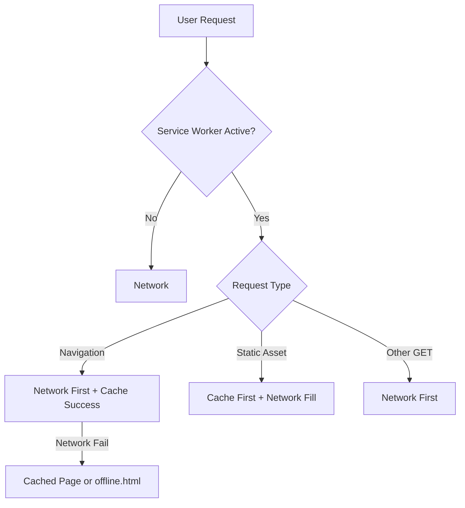

# PWA Offline + Mobile Readiness Proposal

## 1) Problem Statement

The app has a web manifest but no service worker registration, no runtime page caching strategy, and no shared offline UX pattern. When connectivity is lost, multiple views fail silently or redirect to login-like paths, which creates a broken experience on mobile and desktop.

## 2) Scope

- In scope:
  - Add service worker registration and runtime caching strategy.
  - Add offline fallback page/asset for navigation failures.
  - Add global online/offline status messaging.
  - Prevent auth/onboarding guard from misrouting users when offline.
  - Improve mobile safe-area behavior for fixed headers/nav.
  - Add tests for new cache/offline decision logic.
- Out of scope (non-goals):
  - Full offline write synchronization queue for mutations.
  - Background sync/replay of failed POST/PUT/DELETE requests.

## 3) User Stories

- As a mobile user, I want previously visited pages to open while offline so I can still read content.
- As a user with flaky internet, I want clear offline messaging so I know why actions fail.
- As a returning user, I want installable PWA behavior with resilient shell loading.

## 4) Acceptance Criteria

- [ ] Service worker is registered in production and controls app requests.
- [ ] Navigations are cached and offline navigation falls back to a dedicated offline page.
- [ ] Static assets (JS/CSS/fonts/images/manifest/icons) are cached for offline reuse.
- [ ] A global connectivity banner appears when offline and clears when online.
- [ ] Onboarding/auth guard does not redirect to login solely due to offline network errors.
- [ ] Mobile fixed navigation respects safe-area insets.
- [ ] Unit tests cover request classification/caching rules.

## 5) Architecture and Data Flow

- Component boundaries:
  - `ServiceWorkerRegistration` client component handles registration lifecycle.
  - `OfflineBanner` client component centralizes connectivity messaging.
  - `sw.js` handles runtime caching and navigation fallback.
  - `pwa-cache.ts` centralizes cache names and request classification logic.
- Data flow:
  - Browser request -> service worker strategy -> cache/network -> response.
  - Online/offline events -> React state -> shared UI banner.
- API boundaries:
  - API mutation traffic remains network-only.
  - GET API fallback remains app-level error handling, not persistent SW caching.
- Auth/data access/security implications:
  - Avoid cache persistence of authenticated API JSON bodies in SW by default.
  - Cache page/document and static assets only.

## 6) Technical Approach

- Add `public/sw.js` with:
  - install/activate lifecycle (`skipWaiting`, `clients.claim`)
  - navigation strategy (network-first, fallback to cache/offline page)
  - static asset strategy (cache-first)
  - runtime page cache updates
- Add `public/offline.html` fallback.
- Add `ServiceWorkerRegistration` in root layout.
- Add `OfflineBanner` in root layout for global messaging.
- Add `pwa-cache.ts` helpers and tests.
- Update `OnboardingGuard` to handle offline errors explicitly.
- Add mobile safe-area CSS updates for fixed UI.

## 7) Alternatives Considered

### Option A (Recommended)

- Hand-rolled service worker + shared offline UI + explicit guard behavior.
- Impact: Full control and minimal dependency surface.
- Effort: Medium.
- Risks: Must maintain custom SW logic.
- Maintenance cost: Moderate and explicit.

### Option B

- Integrate `next-pwa` plugin.
- Impact: Faster setup, less custom code.
- Effort: Medium.
- Risks: Plugin compatibility drift with latest Next versions.
- Maintenance cost: External dependency + plugin config complexity.

### Option C (Do Nothing)

- Keep manifest-only setup.
- Impact: No true offline resilience.
- Effort: None.
- Risks: Broken UX under network loss.
- Maintenance cost: Ongoing support burden from production issues.

## 8) Risks and Tradeoffs

- Cached pages may be stale offline until refreshed online.
- Offline mode supports read-first behavior, not guaranteed offline writes.
- Service worker bugs can impact request handling; keep logic conservative.
- Rollback strategy: remove registration component and `sw.js`; deploy to clear new worker lifecycle.

## 9) Edge Cases and Failure Modes

- First-visit while offline: show static offline fallback.
- Returning user offline: previously visited pages and app shell load from cache.
- Offline during onboarding/auth checks: show explicit offline blocker, avoid false logout redirect.
- Intermittent connectivity: banner updates live based on browser online/offline events.

## 10) Test Strategy

- Unit tests:
  - `pwa-cache` request classification and cacheability decisions.
- Integration tests:
  - Not added in this pass (Playwright offline emulation can be follow-up).
- Manual verification:
  - Installability, offline reload, and route fallback in devtools Application panel.
- Deferred tests:
  - E2E offline mutation queue scenarios deferred due out-of-scope sync architecture.
