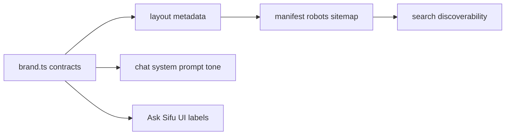

## Summary

Rebrands the web application around Sifu Master identity, centralizes branding/SEO/tone contracts, renames Coach Chat to Ask Sifu surfaces, and adds metadata routes (`manifest`, `robots`, `sitemap`) with canonical icon wiring.

## Proposal / Design Links

- [Sifu Branding, SEO, and Ask Sifu Rebrand Roadmap](./sifu-branding-seo-roadmap.md)
- [Sifu Brand System](../design/sifu-brand-system.md)

## Problem Statement

Brand copy and metadata were fragmented, web manifest fields were placeholder values, and AI tone consistency was not enforced centrally.

## Scope

- Centralized brand + SEO + tone config
- Ask Sifu naming refresh in key UX surfaces
- Metadata and manifest implementation
- Doc updates for architecture remit and design system
- Tests for brand config and metadata routes

## Non-Goals

- No database schema changes
- No provider/model entitlement logic changes
- No redesign of all dashboard pages beyond branding copy/icon updates

## User Stories

- As an interview candidate, I want Sifu-branded guidance and mode naming so the product feels consistent.
- As a search user, I want clear metadata and sitemap discovery so Sifu Quest appears for coding interview coaching terms.
- As an engineer, I want brand/tone values centralized so copy and prompt behavior do not drift.

## Acceptance Criteria

- [x] Manifest has Sifu-specific identity and theme values.
- [x] Ask Sifu naming appears in key dashboard/chat navigation surfaces.
- [x] Root metadata uses centralized SEO contract.
- [x] `robots`, `sitemap`, and `manifest` routes exist.
- [x] Architecture/design docs include branding + tone remit.

## Implementation Notes

- Added `src/lib/brand.ts` as single source of truth for brand name, emojis, SEO keywords, mode labels, canonical URL, and Sifu tone guidance.
- App metadata in `layout.tsx` now references shared contracts and includes icons + social metadata.
- Chat system prompt builder now appends Sifu Master tone guardrails.
- Static template public assets were removed to reduce branding noise.

## Alternatives Considered

1. Keep copy inline per component: rejected due to drift and duplication.
2. Add partial metadata only in layout: rejected due to weak SEO boundary coverage.
3. Preserve default template artifacts: rejected due to brand dilution.

## Edge Cases and Failure Modes

- Missing canonical env vars fall back to `VERCEL_URL` or localhost.
- Metadata routes remain public through middleware exclusions.
- System prompt defaults to Sifu tone even when a mode file is missing.

## DRY / Tech Debt Impact

- Removed repeated hardcoded brand strings in key routes/components.
- Added centralized contracts to reduce future copy/tone drift.

## Architecture / Flow Diagram (Mermaid, if helpful)



## Test Plan

### Automated Tests

- [x] Unit
- [x] Integration
- [ ] E2E
- [ ] N/A (explain below)

Commands run:

```bash
npm run test
```

Results:

- Added unit tests for brand constants/tone guidance.
- Added metadata route tests for manifest/robots/sitemap outputs.

### Manual Verification

- [x] Verified key Ask Sifu copy and mode labels in updated source surfaces.
- [x] Verified manifest route values and icon paths.

## Risks and Mitigations

- Risk: emoji-heavy labels can create visual clutter.
- Mitigation: centralized emoji usage boundaries in design docs and restrained SEO-field usage.

## Rollout / Rollback

- Rollout via normal deployment.
- Rollback by reverting branch commits if metadata or copy causes regressions.

## Follow-ups

- Add authenticated E2E harness to remove route-skip behavior in current Playwright tests.
