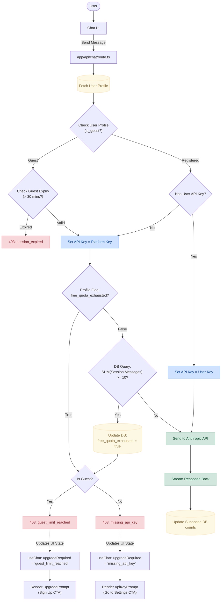

# Technical Architecture
> Overview of Sifu Quest runtime, infrastructure, and core modules.
>
> See also: [Provider, Pricing, and Telemetry Technical Decision Roadmap](./provider-pricing-roadmap.md) for the planned OpenRouter + Anthropic rollout, quota policy, and usage telemetry design.

## High-Level Architecture

```
┌──────────────────────────────────────────────────────────────────┐
│                          VERCEL (Edge)                           │
│                                                                  │
│  ┌────────────┐  ┌──────────────┐  ┌──────────────────────────┐ │
│  │  Next.js   │  │  API Routes  │  │  Sentry (client/server/  │ │
│  │  App Router│──│  (Node.js)   │  │  edge monitoring)        │ │
│  │  (React)   │  │              │  └──────────────────────────┘ │
│  └─────┬──────┘  └──────┬───────┘                               │
│        │                │                                        │
└────────┼────────────────┼────────────────────────────────────────┘
         │                │
         │   ┌────────────┴───────────────────┐
         │   │         Supabase Cloud         │
         │   │                                │
         │   │  ┌─────────┐  ┌─────────────┐ │
         │   │  │  Auth   │  │  PostgreSQL  │ │
         │   │  │ (Google, │  │  (7 tables   │ │
         │   │  │  Anon)  │  │   with RLS)  │ │
         │   │  └─────────┘  └─────────────┘ │
         │   └────────────────────────────────┘
         │
    ┌────┴──────────┐
    │  Anthropic API │
    │  (Claude LLM)  │
    └────────────────┘
```

**Request lifecycle:**

1. User opens a page → Next.js serves the React app (static or dynamic).
2. Client-side actions hit `/api/*` routes running on Node.js serverless functions.
3. Each API route authenticates the user via **NextAuth** (`web/src/auth.ts`).
4. Authenticated routes read/write data to **Supabase PostgreSQL** via `@supabase/ssr`.
5. Chat routes stream responses from the **Anthropic Claude API**.
6. Errors across all runtimes are captured by **Sentry**.

---

## Technology Stack

| Layer            | Technology                              | Version    |
| ---------------- | --------------------------------------- | ---------- |
| Framework        | Next.js (App Router, Turbopack)         | 16.1.6     |
| Language         | TypeScript                              | 5.x        |
| UI               | React + Tailwind CSS                    | 19.x / 4.x |
| Auth             | NextAuth.js (v5 beta) + Supabase Auth   | 5.0-beta   |
| Database         | Supabase (PostgreSQL)                   | —          |
| LLM              | Anthropic Claude (via `@anthropic-ai/sdk`) | —       |
| Monitoring       | Sentry (`@sentry/nextjs`)               | 10.x       |
| Hosting          | Vercel                                  | —          |
| Encryption       | Node.js `crypto` (AES-256-CBC)          | built-in   |


## API Route Reference

All routes live under `src/app/api/` and require authentication via `auth()` from `web/src/auth.ts`.

| Route                            | Method | Purpose                                        |
| -------------------------------- | ------ | ---------------------------------------------- |
| `/api/auth/[...nextauth]`        | *      | NextAuth handler (Google + Anonymous login)    |
| `/api/auth/apikey`               | POST/DELETE | Save or delete encrypted Anthropic API key |
| `/api/account`                   | DELETE | GDPR-compliant full account wipe               |
| `/api/chat`                      | POST   | Stream Claude responses (SSE)                  |
| `/api/chat/session`              | GET/POST | Fetch or create chat sessions               |
| `/api/dsa/log`                   | POST   | Log a DSA problem to memory + progress         |
| `/api/encrypt-key`               | POST   | Utility: encrypt an API key                    |
| `/api/jobs`                      | POST   | Log job application updates                    |
| `/api/link-google/callback`      | GET    | Supabase OAuth callback for identity linking   |
| `/api/memory`                    | GET    | Read memory files or list all files            |
| `/api/onboarding`                | POST   | Complete user onboarding, generate plan        |
| `/api/plan/toggle`               | POST   | Toggle plan checklist items                    |
| `/api/progress`                  | GET    | Compute dashboard metrics (streak, counters)   |
| `/api/progress/events`           | GET    | Raw progress events for calendar heatmap       |
| `/api/system-design/log`         | POST   | Log system design concept to memory            |

---

## Core Library Modules

Located in `src/lib/`:

| Module               | Purpose                                                                 |
| -------------------- | ----------------------------------------------------------------------- |
| `supabase.ts`        | Creates a **server-side** Supabase client using `@supabase/ssr` with cookie-based auth. Only usable in Server Components and API routes. |
| `supabase-browser.ts`| Creates a **browser-side** Supabase client using `createBrowserClient`. Used in Client Components (e.g., Settings page for `linkIdentity`). |
| `memory.ts`          | Reads/writes memory files from Supabase. Reads mode files from the filesystem (`src/modes/`). |
| `apikey.ts`          | Encrypts user-provided Anthropic keys (`sk-ant-...`) with **AES-256-CBC** before storage. Decrypts only at chat-time to call Anthropic. Uses a `randomBytes(16)` IV per encryption. |
| `progress.ts`        | Helper functions `logProgressEvent()` and `logAuditEvent()` for inserting rows into `progress_events` and `audit_log`. |
| `metrics.ts`         | Computes dashboard metrics (current streak, total activity days) by querying `progress_events` from Supabase. |

---

## Coaching Modes

Static markdown system prompts are stored in `src/modes/*.md`:

| File                  | Coaching Mode        |
| --------------------- | -------------------- |
| `dsa.md`              | DSA Problem Solving  |
| `interview-prep.md`   | Interview Prep       |
| `system-design.md`    | System Design        |
| `job-search.md`       | Job Search Strategy  |
| `business-ideas.md`   | Business Ideas       |

These files are read at runtime via `fs.readFile()` in `readModeFile()`. On Vercel, they are bundled into the serverless function's filesystem automatically as part of the Next.js build output.

---


Sentry is initialized across three runtimes:

| Config File              | Runtime | Default Production Sample Rate |
| ------------------------ | ------- | ------------------------------ |
| `sentry.client.config.ts`| Browser | 10% (`0.1`)                    |
| `sentry.server.config.ts`| Node.js | 10% (`0.1`)                    |
| `sentry.edge.config.ts`  | Edge    | 20% (`0.2`)                    |

Sample rates are configurable via `SENTRY_TRACES_SAMPLE_RATE` (server/edge) or `NEXT_PUBLIC_SENTRY_TRACES_SAMPLE_RATE` (client) environment variables. In development, all three default to `1.0` (100%).

The Sentry webpack plugin (`withSentryConfig` in `next.config.ts`) uploads source maps and enables Vercel Cron monitoring automatically.

---


The following diagram illustrates the enforcement of message limits and API keys within the Sifu Quest chat application:


