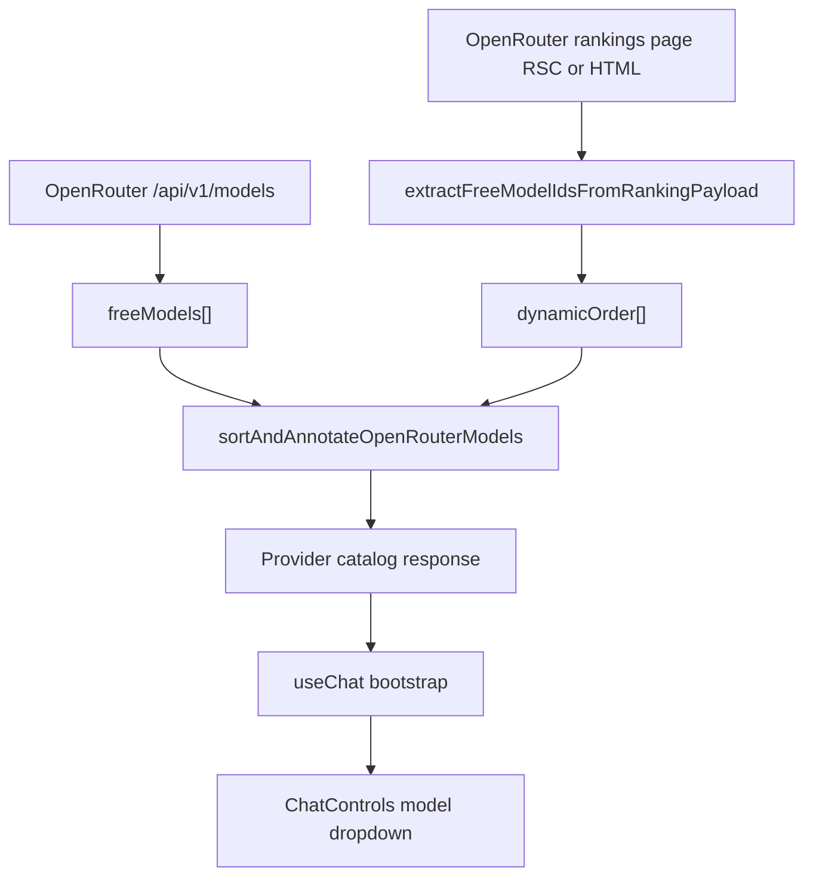

# OpenRouter Dynamic Programming Ranking: Technical Design

## Summary
The provider catalog now uses dynamic OpenRouter ranking data to order free models for programming use-cases, with graceful fallback to normal catalog behavior when ranking data is unavailable.

This path also now records OpenRouter usage/cost telemetry using provider-reported stream metadata when available.

## Implemented Components

### 1. Ranking Payload Extraction
- File: `web/src/lib/openrouter-ranking-utils.ts`
- Function: `extractFreeModelIdsFromRankingPayload(payload)`
- Behavior:
  - Accepts ranking payload text (RSC stream or HTML).
  - Extracts free model ids using multiple patterns:
    - `variant_permaslug`
    - ranking anchor hrefs
    - raw `<provider>/<model>:free` tokens
  - Returns deduplicated lowercase model ids in discovery order.

### 2. Ranking Fetch + Caching
- File: `web/src/lib/provider-catalog.ts`
- Added ranking fetch path:
  - Primary: GET rankings page with `RSC: 1` header.
  - Fallback: GET standard HTML rankings page.
- Performance controls:
  - Short timeout: `AbortSignal.timeout(3500)`
  - App cache: `unstable_cache` revalidate `1800s`
  - In-memory cache for injected fetches: TTL `30m`

### 3. Catalog Integration
- `buildProviderCatalog` now fetches concurrently:
  - free model catalog (`/api/v1/models`)
  - dynamic ranking order
- Sorting logic:
  - If ranking list exists, annotate matching models with `recommendationRank` and sort by rank.
  - If ranking list is empty/unavailable, return original model order unchanged.

### 4. UI Rendering
- File: `web/src/components/chat/ChatControls.tsx`
- Badge rendering based on `recommendationRank`:
  - `#1`: trophy
  - `#2-#3`: medal
  - `#4+`: sparkles
- Works for desktop and mobile controls.

## Failure Handling
The implementation intentionally never blocks chat model loading:

- Ranking endpoint timeout/failure:
  - Logged warning server-side.
  - Returns empty ranking list.
  - Catalog still loads from `/api/v1/models`.
- Ranking payload shape change:
  - Multi-pattern parser attempts extraction.
  - If extraction fails, behavior degrades to normal order.
- Model deprecation/new model release:
  - No static ranking dependency is required for correctness.
  - New models still appear via model catalog endpoint.

## Pricing and Cost Telemetry

### Live Cost Source
- File: `web/src/app/api/chat/route.ts`
- OpenRouter SSE stream parsing now reads usage payload cost fields:
  - `usage.cost`
  - `usage.total_cost` (fallback if `cost` is absent)
- Values are normalized through `parseUsdToMicrousd(...)` in:
  - `web/src/lib/chat-usage.ts`

### Cost Resolution Policy
- Preferred source: provider-reported OpenRouter live cost from stream usage payload.
- Fallback source: internal estimator (`estimateCostMicrousd`).
- Current estimator policy for OpenRouter:
  - returns `0` when tokens exist (acts as safe fallback, not billing source of truth).

### Persistence Path
- Cost and token usage are emitted in final SSE `usage` frame.
- The same values are persisted to DB via post-stream persistence:
  - message-level: `chat_messages` telemetry columns
  - session-level aggregates: `chat_sessions` usage totals via RPC

### Non-Blocking Behavior
- Stream completion is not blocked on persistence.
- After `[DONE]`, persistence runs fire-and-forget with structured error logs for debugging:
  - `sessionId`, `userId`, `provider`, `model`, `requestId`

## Data Flow

## Testing
Added and updated unit coverage:
- `web/src/lib/openrouter-ranking-utils.test.mts`
  - validates extraction across payload shapes.
- Existing tests pass with dynamic-only ordering path.

## Operational Notes
- Recommended observability follow-up:
  - metric/log count for ranking extraction success vs failure.
  - optional cache hit ratio for ranking fetch path.
- If OpenRouter exposes a stable rankings JSON API, fetch path can be swapped with minimal UI changes.
