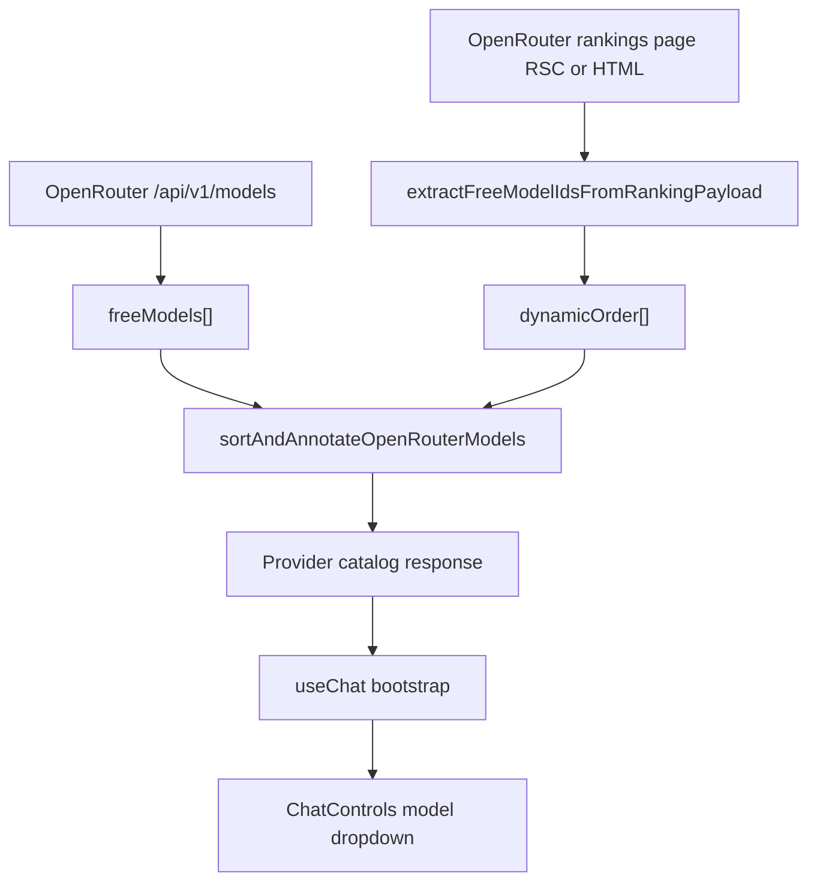

# OpenRouter Dynamic Programming Ranking: Technical Design

## Summary

OpenRouter programming ranking data is used to order model recommendations, with resilient fallback when ranking data is unavailable or malformed.

This path also records OpenRouter usage/cost telemetry using provider-reported stream metadata when available.

## Implementation

### 1) Ranking Extraction
- File: `web/src/lib/openrouter-ranking-utils.ts`
- Inputs: rankings payload text (RSC/HTML)
- Extracts model ids from multiple patterns and deduplicates.
- Validates model-id shape and ignores query/hash-tainted captures to avoid nav-link pollution.

### 2) Fetch + Cache
- File: `web/src/lib/provider-catalog.ts`
- Fetches rankings with bounded timeout.
- Uses `unstable_cache` for app-level reuse.
- Uses short-lived in-memory cache for injected fetch paths.

### 3) Catalog Integration
- `buildProviderCatalog` fetches free catalog + ranking order concurrently.
- Applies `recommendationRank` when ranking data matches.
- Preserves original order on ranking miss/failure.
- Builds `recommended` from the same dropdown catalog slice to keep recommendations selectable.
- Default OpenRouter model prefers top recommendation, then first available.

### 4) UI Behavior
- File: `web/src/components/chat/ChatControls.tsx`
- Renders ranking badges (`#1`, `#2-3`, `#4+`).
- Shows grouped sections: `Recommended`, `Free`, `All`.
- Supports collapse/expand and model search on desktop/mobile.

## Failure Modes

- Ranking fetch timeout/failure: log + fallback to base catalog order.
- Ranking payload drift: parser validation filters non-model captures.
- Model churn: catalog remains source of truth; new models still appear.

## Pricing and Cost Telemetry

### Live Cost Source
- File: `web/src/app/api/chat/route.ts`
- OpenRouter SSE stream parsing reads usage payload cost fields:
  - `usage.cost`
  - `usage.total_cost` (fallback if `cost` is absent)
- Values are normalized through `parseUsdToMicrousd(...)` in:
  - `web/src/lib/chat-usage.ts`

### Cost Resolution Policy
- Preferred source: provider-reported OpenRouter live cost from stream usage payload.
- Fallback source: internal estimator (`estimateCostMicrousd`).
- Current estimator policy for OpenRouter:
  - free models resolve to `0`
  - paid-model fallback remains nullable when no live provider cost is available

### Persistence Path
- Cost and token usage are emitted in final SSE `usage` frame.
- The same values are persisted to DB via post-stream persistence:
  - message-level: `chat_messages` telemetry columns
  - session-level aggregates: `chat_sessions` usage totals via RPC

### Non-Blocking Behavior
- Stream completion is not blocked on persistence.
- After `[DONE]`, persistence runs fire-and-forget with structured error logs for debugging:
  - `sessionId`, `userId`, `provider`, `model`, `requestId`

## Data Flow

## Tests

- `web/src/lib/openrouter-ranking-utils.test.mts`
- `web/src/lib/provider-catalog.test.mts`

Coverage includes extraction behavior, ranking fallback paths, free alias handling (`openrouter/free`), and limit/ordering behavior.
