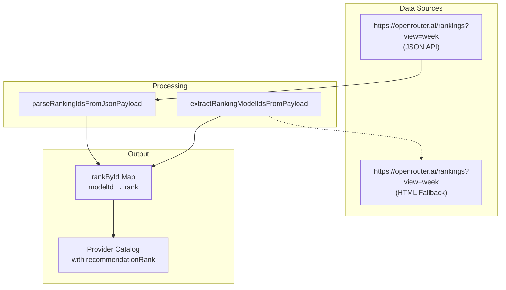
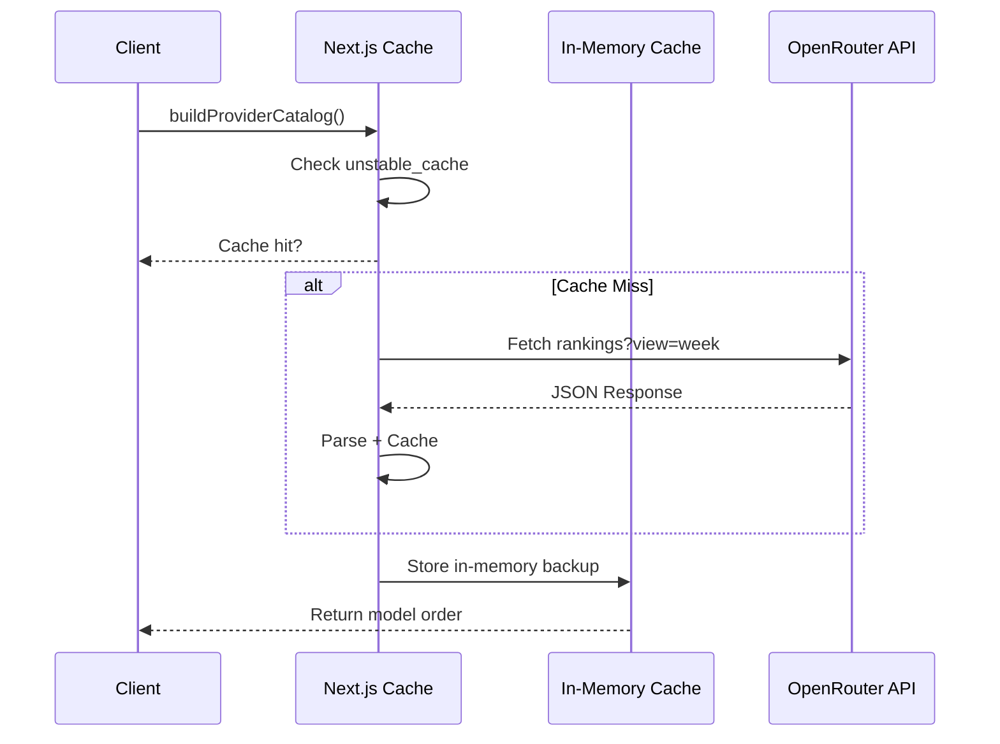
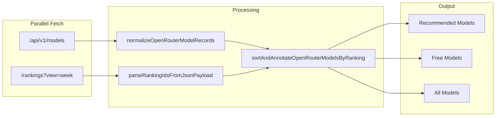

# OpenRouter Dynamic Programming Ranking: Technical Design

## Summary

OpenRouter programming ranking data is used to order model recommendations, with resilient fallback when ranking data is unavailable or malformed. This implementation uses a single source of truth (`view=week` JSON endpoint) for faster, more reliable ranking data.

This path also records OpenRouter usage/cost telemetry using provider-reported stream metadata when available.

## Architecture

### Single Source of Truth



### Key Changes from Previous Version

| Aspect | Before | After |
|--------|--------|-------|
| Data Source | Multiple endpoints, HTML scraping | Single: `view=week` JSON |
| Ranking Merge | Multiple sources merged | Single source (no merge needed) |
| Date Suffix Handling | Duplicate logic in 3 files | Centralized in `chat-provider-config.ts` |
| Fetch Strategy | Sequential | Race condition with timeout |
| Model ID | Simple lookup | Normalized lookup with fallback keys |

## Implementation Details

### 1) Shared Utilities (`chat-provider-config.ts`)

```typescript
// Date suffix stripping for model ID normalization
export function stripModelDateSuffix(modelId: string): string {
  return modelId
    .replace(/-\d{8}$/i, '')       // minimax-m2.5-20260211 → minimax-m2.5
    .replace(/-\d{4}-\d{2}-\d{2}$/i, '')
    .replace(/-\d{2}-\d{2}$/i, '')
}

// Generate all lookup keys for ranking match
export function getRankingLookupKeys(modelId: string): string[] {
  // Returns: [normalized, withoutFree, dateStripped, +:free variants]
}

// Resolve rank using all possible keys
export function resolveModelRank(rankById: Map<string, number>, modelId: string): number | null
```

### 2) Ranking Extraction (`openrouter-ranking-utils.ts`)

- Primary: Parse JSON response from `variant_permaslug` fields
- Fallback: Extract from HTML if JSON fails
- Preserves original model IDs in output (doesn't strip dates when extracting from JSON)

```typescript
export function extractRankingModelIdsFromPayload(payload: string): string[]
export function extractFreeModelIdsFromRankingPayload(payload: string): string[]
```

### 3) Fetch + Cache (`provider-catalog.ts`)



**Caching Strategy:**
- Next.js `unstable_cache`: 30 min TTL for rankings
- In-memory fallback: For custom fetch implementations in tests
- User catalog cache: 2 min TTL, max 120 entries with LRU eviction

### 4) Model Catalog (`openrouter-model-catalog-utils.ts`)

```typescript
// Normalize API response to ChatModelDescriptor[]
export function normalizeOpenRouterModelRecords(records: OpenRouterModelRecord[]): ChatModelDescriptor[]

// Sort by ranking, add recommendationRank
export function sortAndAnnotateOpenRouterModelsByRanking(
  models: ChatModelDescriptor[],
  dynamicOrder: readonly string[]
): ChatModelDescriptor[]

// Build recommended list (limit + ranking)
export function buildRecommendedOpenRouterModels(
  models: ChatModelDescriptor[],
  dynamicOrder: readonly string[],
  limit: number
): ChatModelDescriptor[]
```

### 5) ChatModelDescriptor Schema

```typescript
export type ChatModelDescriptor = {
  id: string;              // Original ID: "openai/gpt-oss-120b:free"
  label: string;           // Human-readable: "OpenAI / GPT OSS 120b (free)"
  modelId: string;         // Slug for UI: "openai-gpt-oss-120b-free"
  provider: ChatProvider;  // "openrouter" | "anthropic"
  isFree: boolean;
  availability: ModelAvailability;
  recommendationRank?: number;  // Ranking position (1 = best)
  reason?: string;
};
```

## Data Flow



## Pricing and Cost Telemetry

### Live Cost Source
- File: `web/src/app/api/chat/route.ts`
- OpenRouter SSE stream parsing reads usage payload cost fields:
  - `usage.cost`
  - `usage.total_cost` (fallback if `cost` is absent)
- Values are normalized through `parseUsdToMicrousd(...)` in:
  - `web/src/lib/chat-usage.ts`

### Cost Resolution Policy
- Preferred source: provider-reported OpenRouter live cost from stream usage payload.
- Fallback source: internal estimator (`estimateCostMicrousd`).
- Current estimator policy for OpenRouter:
  - free models resolve to `0`
  - paid-model fallback remains nullable when no live provider cost is available

### Persistence Path
- Cost and token usage are emitted in final SSE `usage` frame.
- The same values are persisted to DB via post-stream persistence:
  - message-level: `chat_messages` telemetry columns
  - session-level aggregates: `chat_sessions` usage totals via RPC

### Non-Blocking Behavior
- Stream completion is not blocked on persistence.
- After `[DONE]`, persistence runs fire-and-forget with structured error logs for debugging:
  - `sessionId`, `userId`, `provider`, `model`, `requestId`

## Failure Modes

| Scenario | Behavior |
|----------|----------|
| Ranking fetch timeout | Return empty ranking, use recency sort |
| JSON parse failure | Fall back to HTML parsing |
| Model ID not in ranking | Model appears after ranked models |
| Cache stale | Refresh on next request |

## Configuration Constants

```typescript
// Timeouts
const RANKING_FETCH_TIMEOUT_MS = 2500
const OPENROUTER_CATALOG_TTL_MS = 5 * 60 * 1000      // 5 min
const OPENROUTER_RANKINGS_TTL_MS = 30 * 60 * 1000    // 30 min

// Limits
const OPENROUTER_ALL_MODELS_INITIAL_LIMIT = 80
const OPENROUTER_RECOMMENDED_MODELS_LIMIT = 20
const OPENROUTER_RANKING_TOP_MODELS_LIMIT = 10
```

## Tests

- `web/src/lib/openrouter-ranking-utils.test.mts` - Extraction, parsing, date suffix handling
- `web/src/lib/openrouter-model-catalog-utils.test.mts` - Normalization, sorting, recommendations
- `web/src/lib/provider-catalog.test.mts` - Full catalog build, caching

## Performance Considerations

1. **Parallel Fetch**: Models + rankings load simultaneously via `Promise.all`
2. **Race Condition**: First successful ranking response wins (no unnecessary fetches)
3. **In-Flight Deduplication**: Prevents duplicate requests during concurrent calls
4. **Memory Management**: User cache has max entries with LRU eviction
