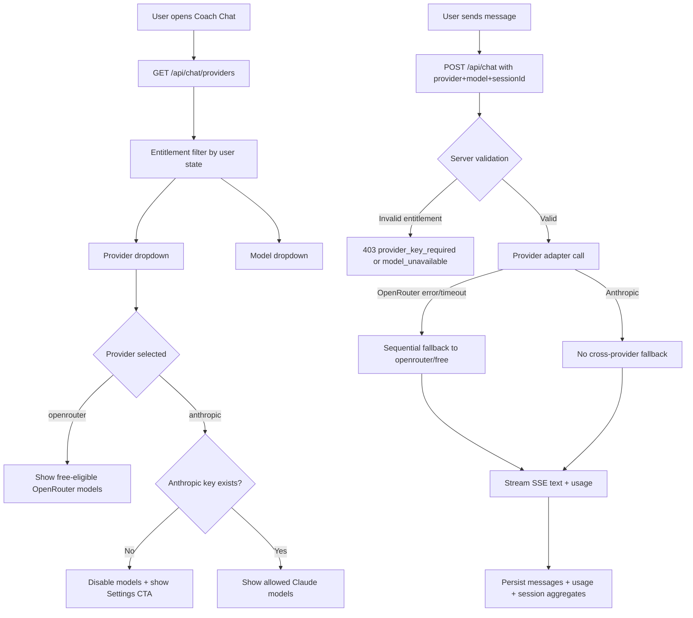
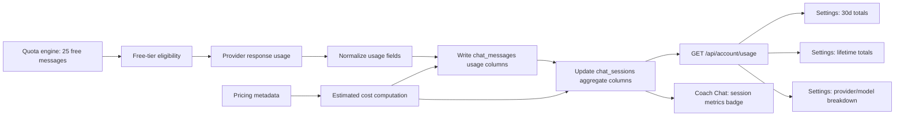

# Provider, Pricing, and Telemetry Technical Decision Roadmap
> Planned implementation roadmap for multi-provider coach chat.

- Status: Approved for implementation
- Date: March 10, 2026
- Owner: Sifu Quest Engineering
- Scope: Coach chat provider/model selection, free-tier pricing policy, and usage telemetry

## Decision Snapshot

Selected options from the planning review:

- `2A` OpenRouter-free only for free/guest usage
- `3A` Dynamic model catalog with guardrails
- `4A` Unit + integration + streaming contract tests
- `5A` Sequential fallback with tight timeouts
- `6A` Per-session selection with account defaults
- `7A` Persist telemetry in `chat_messages` + `chat_sessions` aggregates
- `8A` Show Anthropic disabled with explicit reason and Settings CTA when no Anthropic key
- `9A` Show session + user metrics in chat and settings
- `10B` Increase free quota for rollout
- `11A` Shared OpenRouter key with operator guardrails
- `12A` Initial free quota set to 25 messages
- `13A` New dedicated technical decision document
- `14A` Two Mermaid diagrams (routing + telemetry/pricing flow)

## Provider and Model Availability Matrix

| User State | OpenRouter Provider | OpenRouter Models | Anthropic Provider | Anthropic Models |
| --- | --- | --- | --- | --- |
| Guest | Enabled | Free-eligible models only | Visible, disabled | Disabled with "Add Anthropic key in Settings" reason |
| Signed-in free (no Anthropic key) | Enabled | Free-eligible models only | Visible, disabled | Disabled with "Add Anthropic key in Settings" reason |
| Signed-in with Anthropic key | Enabled | Free-eligible models only | Enabled | Allowed Claude model list (Sonnet/Opus/Haiku variants) |

Notes:

- "CloudSonic" is treated as "Claude Sonnet".
- Server-side entitlement checks are authoritative even if a client payload is tampered.

## Pricing and Quota Policy

- Free-tier quota: `25` user messages per policy window (initial rollout setting).
- Shared OpenRouter key serves free usage for guests and signed-in free users.
- Anthropic usage requires user-provided Anthropic key (BYOK).
- This is target-state policy for rollout; current production limits may differ until migration cutover completes.
- Shared-key guardrails:
  - Server-side per-user quota enforcement.
  - Provider timeout + sequential fallback policy for OpenRouter free path.
  - Operator-side spend and rate-limit caps.

## Public API and Interface Changes

| Endpoint | Method | Change |
| --- | --- | --- |
| `/api/chat/providers` | `GET` | New. Returns provider/model availability based on user entitlement and filtered catalog. |
| `/api/chat` | `POST` | Extend request contract to include `provider` and `model`; enforce entitlement; emit usage frame in SSE stream. |
| `/api/chat/session` | `GET/POST` | Extend session payload to store and return `provider` + `model`. |
| `/api/account/usage` | `GET` | New. Returns usage metrics for settings (30-day + lifetime totals and breakdowns). |

SSE addition in `/api/chat` stream:

- Emit usage payload near stream completion:
  - `{ "type": "usage", "provider": "...", "model": "...", "inputTokens": ..., "outputTokens": ..., "totalTokens": ..., "estimatedCostMicrousd": ..., "latencyMs": ... }`

## Data Model Changes

- `chat_messages` additions:
  - `provider`, `model`, `input_tokens`, `output_tokens`, `total_tokens`, `latency_ms`, `estimated_cost_microusd`, `request_id`
- `chat_sessions` additions:
  - `provider`, `model`, `user_turns_count`, `input_tokens_total`, `output_tokens_total`, `total_tokens_total`, `estimated_cost_microusd_total`
- `user_profiles` additions:
  - `default_provider`, `default_model`
- New `user_api_keys` table:
  - `user_id`, `provider`, `api_key_enc`, `created_at`, `updated_at`
  - Unique key on `(user_id, provider)`

## UI Surfaces

- Coach chat:
  - Provider dropdown with availability state labels.
  - Model dropdown scoped to selected provider and user entitlement.
  - Session metrics badge/panel showing turns, tokens, and estimated cost.
- Settings:
  - Anthropic key management.
  - Usage panel with 30-day totals, lifetime totals, provider/model breakdowns.

## Rollout Plan

1. Schema-first migration:
   - Add new tables/columns/indexes with backward-compatible defaults.
2. Backward-compatible reads:
   - Read legacy fields while new fields are being populated.
3. Incremental API enablement:
   - Add provider catalog endpoint and request validation.
4. UI staged enablement:
   - Enable provider/model selectors and availability messaging.
5. Telemetry verification:
   - Validate token/cost aggregation correctness and no double-counting.
6. Quota tuning:
   - Start at 25 messages and adjust after observing production telemetry.

## Risks and Mitigations

| Risk | Mitigation |
| --- | --- |
| Provider rate limits / temporary outages | Sequential fallback for OpenRouter free path with bounded timeouts and safe error UX. |
| Catalog fetch failures | Cache last known-good model catalog; fallback to curated safe model list if needed. |
| Partial usage metrics from provider responses | Persist nullable usage fields and display "partial data" states in UI instead of guessing. |
| Double-counting during fallback/retry | Persist usage only once per completed assistant response using idempotency guard (`request_id` + session checks). |

## Mermaid Diagrams

## Validation Plan

1. Verify Markdown links render and resolve in GitHub preview.
2. Verify Mermaid blocks render in both diagrams.
3. Verify API/type names in this doc match planned implementation contracts exactly.
4. Verify no contradictions with existing `docs/technical/database.md` and `docs/technical/architecture.md`.

## Assumptions

- "CloudSonic" is treated as "Claude Sonnet".
- This is a technical decision roadmap document, not marketing copy.
- This document captures implementation direction and contracts; code changes are tracked separately.
